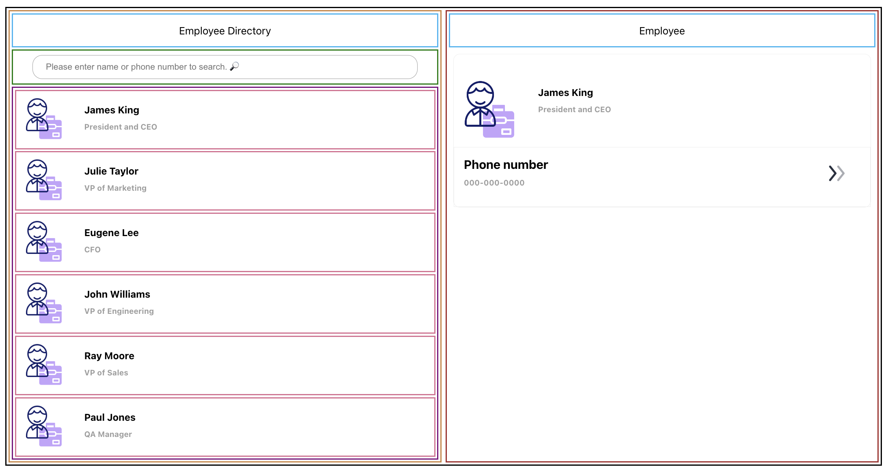
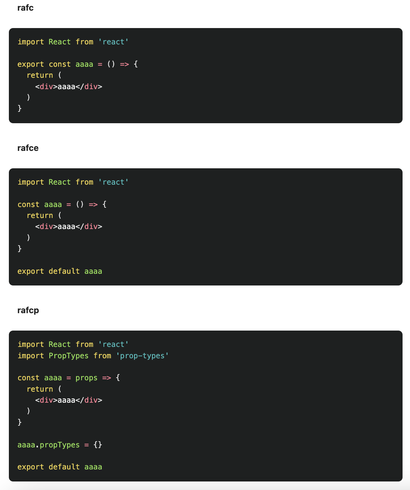

# ALAB 320H.1.1 - React Page Layout
> 

## Learning Objectives
> - After completing this lab, learners will be able to:
> - Create a page from a mockup using React.
> - Style React components to create a desired layout.

## Getting started with creating React app
```
npx create-react-app eml-list
```

</div>

## Boiler plate commend for an each component  
</div>

### Study materials
> - [React Tutorial for Beginners](https://youtu.be/SqcY0GlETPk?si=02QQ6p5AZJW9T-m8)
> - [React Crash Course 2024 by Traversy Media](https://www.youtube.com/watch?v=LDB4uaJ87e0&t=225s)
> - [ReAct Developer](https://chromewebstore.google.com/detail/react-developer-tools/fmkadmapgofadopljbjfkapdkoienihi?hl=en-US&utm_source=ext_sidebar)

